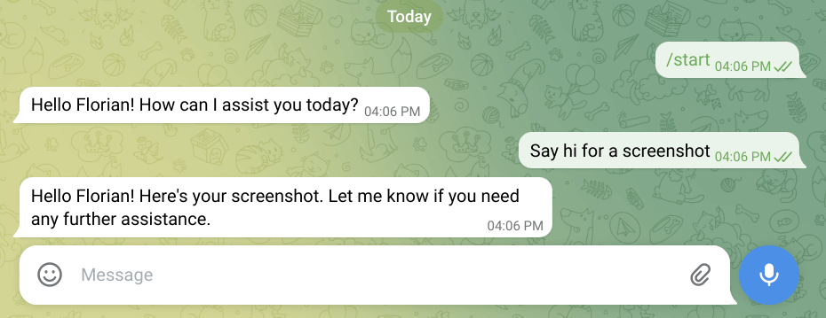
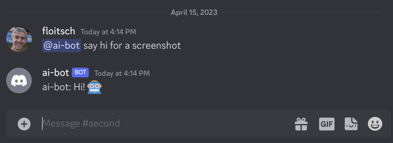
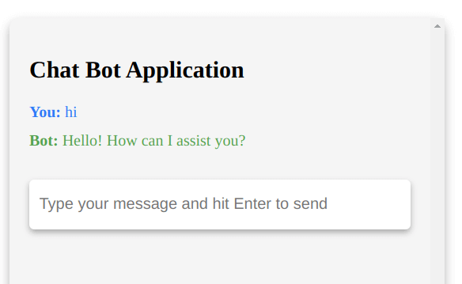

# Chat Bot

A package that can be used to create a chat bot. Handles all the
underlying communication with OpenAI, but requires users of this
package to implement the interaction with the chat service.

## Examples
### Telegram

See [examples/telegram](examples/telegram) for an example of how to
use and set up this package to create a Telegram bot.

### Discord

See [examples/discord](examples/discord) for an example of how to
use and set up this package to create a Discord bot.

### HTTP

See [examples/http](examples/http) for an example of how to
use this package to create a HTTP bot.
